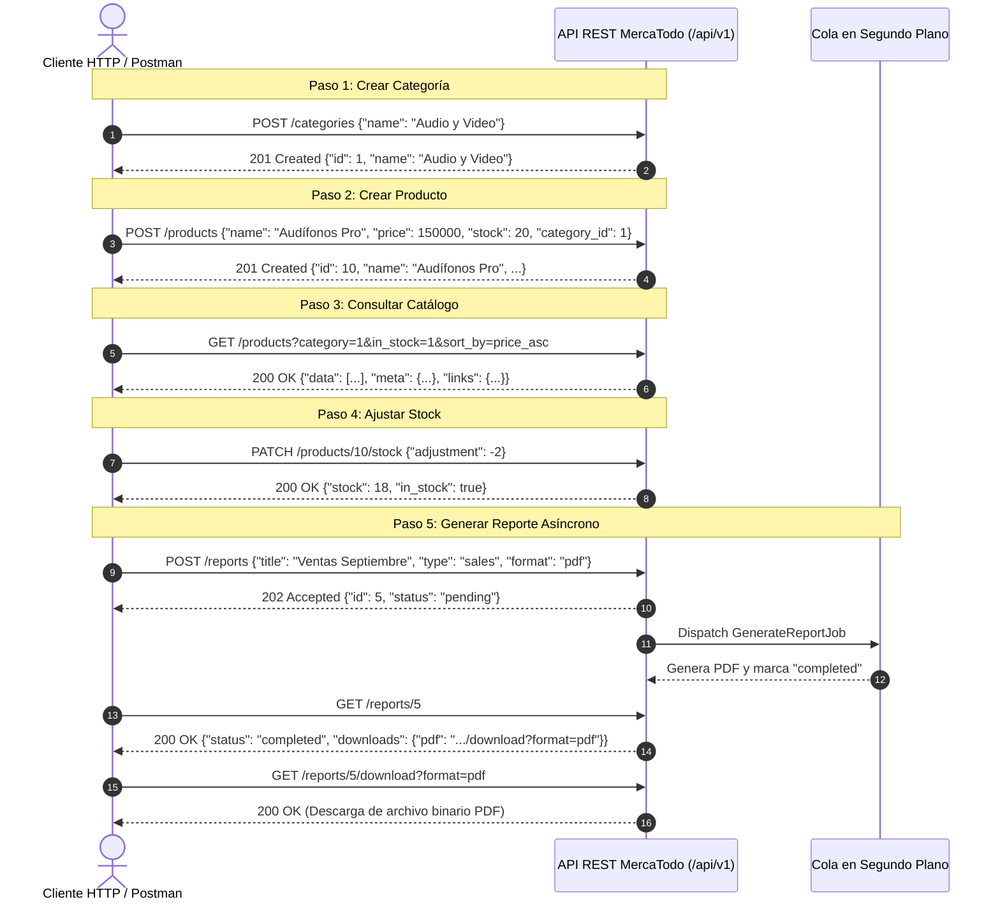

# Documentación de la API REST v1 - MercaTodo

Bienvenido a la especificación y guía de consumo de la **API REST v1 de MercaTodo**. 
Esta API ha sido concebida, diseñada e implementada bajo las directrices del blog oficial de Postman:
> **"Buenas prácticas para las API REST: Guía para desarrolladores sobre cómo crear API confiables"**
> *(Best Practices for REST APIs: A Developer's Guide to Building Reliable APIs)*

---

## Índice

1. [Principios de Diseño y Buenas Prácticas de Postman](#1-principios-de-diseño-y-buenas-prácticas-de-postman)
2. [Guía Paso a Paso: ¿Cómo Consumir la API?](#2-guía-paso-a-paso-cómo-consumir-la-api)
   - [2.1 Requisitos Previos y Entorno](#21-requisitos-previos-y-entorno)
   - [2.2 Reglas Fundamentales de Comunicación](#22-reglas-fundamentales-de-comunicación)
   - [2.3 Flujo de Consumo de Negocio (Paso a Paso)](#23-flujo-de-consumo-de-negocio-paso-a-paso)
   - [2.4 Cómo Consumir desde Postman](#24-cómo-consumir-desde-postman)
   - [2.5 Ejemplos de Consumo en Código (Fetch, Axios, Python, cURL)](#25-ejemplos-de-consumo-en-código-fetch-axios-python-curl)
3. [Convenciones Globales y Cabeceras](#3-convenciones-globales-y-cabeceras)
4. [Estructura Uniforme de Respuestas (JSON Envelope)](#4-estructura-uniforme-de-respuestas-json-envelope)
5. [Códigos de Estado HTTP Utilizados](#5-códigos-de-estado-http-utilizados)
6. [Módulo de Categorías (`/api/v1/categories`)](#6-módulo-de-categorías)
7. [Módulo de Productos (`/api/v1/products`)](#7-módulo-de-productos)
8. [Módulo de Reportes y Analítica (`/api/v1/reports`)](#8-módulo-de-reportes-y-analítica)
9. [Importación y Exportación Masiva de Productos](#9-importación-y-exportación-masiva-de-productos)
10. [Pruebas Automatizadas en Postman](#10-pruebas-automatizadas-en-postman)

---

## 1. Principios de Diseño y Buenas Prácticas de Postman

La API de MercaTodo implementa los principios fundamentales recomendados por Postman para garantizar robustez, previsibilidad y facilidad de integración:

- **Diseño orientado a recursos con sustantivos en plural**: Los endpoints representan entidades sustantivas (`/products`, `/categories`, `/reports`), evitando verbos en la ruta (e.g. no existen rutas como `/createProduct` o `/getReport`).
- **Semántica estricta de Verbos HTTP**:
  - `GET`: Recuperación de recursos (Seguro e Idempotente).
  - `POST`: Creación de recursos o activación de acciones no idempotentes (e.g., encolar reporte). Retorna `201 Created` o `202 Accepted`.
  - `PUT`: Reemplazo/actualización total del recurso (Idempotente).
  - `PATCH`: Modificación parcial de atributos específicos de un recurso (Idempotente).
  - `DELETE`: Eliminación del recurso (Idempotente). Retorna `204 No Content` tras el borrado exitoso.
- **Jerarquía y relaciones claras en sub-recursos**: Modelado de pertenencia relacional como `/api/v1/categories/{category}/products`.
- **Versionamiento explícito en la URI (`/api/v1/`)**: Permite la evolución no disruptiva de la API protegiendo a los clientes existentes.
- **Paginación, filtrado y ordenamiento predecibles**: Se controlan mediante query parameters explícitos (`per_page`, `page`, `category_id`, `search`, `sort_by`, etc.).
- **Procesamiento Asíncrono desacoplado**: Operaciones analíticas pesadas o generadores de archivos en segundo plano responden de inmediato con `202 Accepted`, exponiendo endpoints de consulta de estado y descarga.

---

## 2. Guía Paso a Paso: ¿Cómo Consumir la API?

Esta sección explica de manera clara, práctica e interactiva cómo cualquier desarrollador o aplicación cliente (Frontend Web, App Móvil, scripts o Postman) puede comunicarse con la API de MercaTodo.

### 2.1 Requisitos Previos y Entorno

1. **Servidor activo**:
   Asegúrese de que los contenedores de Docker estén en ejecución:
   ```bash
   docker compose up -d
   ```
2. **URL Base**:
   Todos los endpoints de la versión 1 comienzan por:
   ```
   http://localhost:8000/api/v1
   ```

---

### 2.2 Reglas Fundamentales de Comunicación

Para que cualquier petición sea procesada adecuadamente por la API, aplique siempre estas dos reglas:

1. **Cabecera `Accept: application/json` (Obligatoria)**:
   - Debe enviarse en **todas** las peticiones (`GET`, `POST`, `PUT`, `PATCH`, `DELETE`).
   - Garantiza que cualquier error o validación se devuelva en formato JSON estandarizado en lugar de páginas HTML.
2. **Cabecera `Content-Type: application/json` (En peticiones con cuerpo)**:
   - Obligatoria al enviar datos en peticiones `POST`, `PUT` o `PATCH` con formato JSON.
   - **Excepción**: Al enviar archivos o imágenes (como en la subida de imágenes o importación Excel), use `multipart/form-data` (la herramienta o biblioteca HTTP asignará el `Content-Type` correspondiente automáticamente con su boundary).

---

### 2.3 Flujo de Consumo de Negocio (Paso a Paso)

A continuación se ilustra el ciclo de vida habitual para interactuar con la plataforma:



#### Paso 1: Crear una Categoría
Petición `POST /api/v1/categories`:
```bash
curl -X POST "http://localhost:8000/api/v1/categories" \
     -H "Accept: application/json" \
     -H "Content-Type: application/json" \
     -d '{"name": "Gaming", "description": "Consolas, periféricos y videojuegos"}'
```
*Respuesta*: Retorna código `201 Created` con el ID asignado (por ejemplo, `id: 3`).

#### Paso 2: Crear un Producto vinculado a la Categoría
Petición `POST /api/v1/products`:
```bash
curl -X POST "http://localhost:8000/api/v1/products" \
     -H "Accept: application/json" \
     -H "Content-Type: application/json" \
     -d '{
       "name": "Control Inalámbrico Pro",
       "description": "Control con vibración háptica y conectividad Bluetooth",
       "price": 280000,
       "stock": 15,
       "category_id": 3
     }'
```
*Respuesta*: Retorna `201 Created` con cabecera `Location: http://localhost:8000/api/v1/products/4` y el recurso serializado.

#### Paso 3: Consultar el Catálogo con Filtros, Paginación y Búsqueda
Petición `GET /api/v1/products`:
```bash
curl -X GET "http://localhost:8000/api/v1/products?category=3&min_price=100000&sort_by=price_asc&per_page=10" \
     -H "Accept: application/json"
```
*Respuesta*: Retorna código `200 OK` con el arreglo de productos en `data` y objetos de navegación `meta` y `links`.

#### Paso 4: Ajustar Stock Parcialmente
Petición `PATCH /api/v1/products/{id}/stock`:
```bash
curl -X PATCH "http://localhost:8000/api/v1/products/4/stock" \
     -H "Accept: application/json" \
     -H "Content-Type: application/json" \
     -d '{"adjustment": -3}'
```
*Respuesta*: Retorna `200 OK` reflejando el stock actualizado de 15 a 12 unidades.

#### Paso 5: Solicitar un Reporte Asíncrono y Descargarlo
1. **Encolar el reporte**:
   ```bash
   curl -X POST "http://localhost:8000/api/v1/reports" \
        -H "Accept: application/json" \
        -H "Content-Type: application/json" \
        -d '{
          "title": "Balance de Ventas",
          "type": "sales",
          "format": "pdf",
          "date_from": "2026-01-01",
          "date_to": "2026-09-09"
        }'
   ```
   *Respuesta inmediata*: `202 Accepted` con `status: "pending"`, `id: 8`.
2. **Consultar estado**:
   ```bash
   curl -X GET "http://localhost:8000/api/v1/reports/8" \
        -H "Accept: application/json"
   ```
   *Respuesta*: Cuando finaliza, `status` es `"completed"` y `downloads.pdf` contiene el enlace de descarga.
3. **Descargar el archivo PDF generado**:
   ```bash
   curl -X GET "http://localhost:8000/api/v1/reports/8/download?format=pdf" \
        --output reporte_8.pdf
   ```

---

### 2.4 Cómo Consumir desde Postman

Para interactuar con la API usando la interfaz gráfica de **Postman**:

1. **Crear una Colección**:
   - En Postman, pulse en **New** > **Collection** y nómbrela `MercaTodo API v1`.
2. **Configurar Variable de Entorno**:
   - En la pestaña **Variables** de la colección, agregue:
     - Variable: `base_url`
     - Initial value: `http://localhost:8000/api/v1`
     - Current value: `http://localhost:8000/api/v1`
3. **Configurar Cabeceras Predeterminadas en la Colección**:
   - En la pestaña **Headers** de la colección, agregue:
     - `Accept`: `application/json`
4. **Configurar una Petición GET (Listado)**:
   - Método: `GET`
   - URL: `{{base_url}}/products?per_page=10&in_stock=1`
   - Pulse en **Send**.
5. **Configurar una Petición POST o PUT con JSON**:
   - Método: `POST`
   - URL: `{{base_url}}/products`
   - Pestaña **Body** > Seleccione opción **raw** > Cambie el menú desplegable de `Text` a **JSON**.
   - Ingrese el payload JSON y pulse **Send**.
6. **Subir Archivos (Imágenes o Excel)**:
   - Pestaña **Body** > Seleccione **form-data**.
   - Escriba la clave `image` o `file`, pase el ratón por el campo de la clave, cambie el tipo a **File** y seleccione el archivo desde su computadora.

---

### 2.5 Ejemplos de Consumo en Código (Fetch, Axios, Python, cURL)

#### A. JavaScript / TypeScript (Nativo con Fetch API)
```javascript
// Obtener productos activos con precio menor a $500,000
async function getProducts() {
  const url = new URL('http://localhost:8000/api/v1/products');
  url.searchParams.set('in_stock', '1');
  url.searchParams.set('max_price', '500000');
  url.searchParams.set('sort_by', 'price_asc');

  const response = await fetch(url, {
    method: 'GET',
    headers: {
      'Accept': 'application/json'
    }
  });

  const result = await response.json();
  if (result.success) {
    console.log('Productos:', result.data);
    console.log('Total de páginas:', result.meta.last_page);
  } else {
    console.error('Error:', result.message);
  }
}

// Crear un nuevo producto
async function createProduct(productData) {
  const response = await fetch('http://localhost:8000/api/v1/products', {
    method: 'POST',
    headers: {
      'Accept': 'application/json',
      'Content-Type': 'application/json'
    },
    body: JSON.stringify(productData)
  });

  const result = await response.json();
  if (response.status === 201) {
    console.log('Producto creado con ID:', result.data.id);
  } else if (response.status === 422) {
    console.error('Errores de validación:', result.errors);
  }
}
```

#### B. JavaScript con Axios
```javascript
import axios from 'axios';

const api = axios.create({
  baseURL: 'http://localhost:8000/api/v1',
  headers: {
    'Accept': 'application/json',
    'Content-Type': 'application/json'
  }
});

// Ajuste rápido de inventario
async function adjustStock(productId, units) {
  try {
    const response = await api.patch(`/products/${productId}/stock`, {
      adjustment: units
    });
    console.log('Nuevo stock:', response.data.data.stock);
  } catch (error) {
    if (error.response?.status === 422) {
      console.error('No se pudo ajustar stock:', error.response.data.message);
    }
  }
}
```

#### C. Python (Librería `requests`)
```python
import requests

BASE_URL = "http://localhost:8000/api/v1"
HEADERS = {
    "Accept": "application/json",
    "Content-Type": "application/json"
}

# 1. Consultar métricas en tiempo real
res_metrics = requests.get(f"{BASE_URL}/reports/metrics/sales", headers=HEADERS)
if res_metrics.status_code == 200:
    sales_data = res_metrics.json()["data"]
    print(f"Total Ventas: ${sales_data['total_sales']}")

# 2. Encolar reporte asíncrono
report_payload = {
    "title": "Reporte Semanal Python",
    "type": "sales",
    "format": "pdf",
    "date_from": "2026-09-01",
    "date_to": "2026-09-08"
}
res_report = requests.post(f"{BASE_URL}/reports", json=report_payload, headers=HEADERS)
if res_report.status_code == 202:
    report_info = res_report.json()["data"]
    print(f"Reporte encolado con ID: {report_info['id']}, Estado: {report_info['status']}")
```

---

## 3. Convenciones Globales y Cabeceras

### URL Base
```
http://localhost:8000/api/v1
```

### Cabeceras Obligatorias / Recomendadas
| Cabecera | Valor | Descripción |
| :--- | :--- | :--- |
| `Accept` | `application/json` | Solicita explícitamente formato JSON para evitar respuestas HTML ante errores. |
| `Content-Type` | `application/json` | Requerido en peticiones `POST`, `PUT`, `PATCH` con cuerpo JSON (excepto multipart). |

---

## 4. Estructura Uniforme de Respuestas (JSON Envelope)

Todas las respuestas de la API cumplen con esquemas consistentes y unificados.

### 4.1. Respuesta Exitosa Simple (`200 OK`, `201 Created`)
```json
{
  "success": true,
  "message": "Operación realizada con éxito.",
  "data": {
    "id": 1,
    "name": "Ejemplo"
  }
}
```

### 4.2. Respuesta Paginada (`200 OK`)
```json
{
  "success": true,
  "message": "Listado obtenido exitosamente.",
  "data": [
    { "id": 1, "name": "Elemento 1" },
    { "id": 2, "name": "Elemento 2" }
  ],
  "meta": {
    "current_page": 1,
    "per_page": 15,
    "total": 50,
    "last_page": 4,
    "from": 1,
    "to": 15
  },
  "links": {
    "first": "http://localhost:8000/api/v1/resource?page=1",
    "last": "http://localhost:8000/api/v1/resource?page=4",
    "prev": null,
    "next": "http://localhost:8000/api/v1/resource?page=2"
  }
}
```

### 4.3. Respuesta de Aceptación Asíncrona (`202 Accepted`)
```json
{
  "success": true,
  "message": "Solicitud aceptada y encolada para su procesamiento.",
  "data": {
    "id": 12,
    "status": "pending",
    "is_pending": true
  }
}
```

### 4.4. Respuesta de Error Estructurada (`400`, `401`, `403`, `404`, `409`, `422`, `500`)
```json
{
  "success": false,
  "message": "Los datos enviados no son válidos.",
  "errors": {
    "name": [
      "El nombre del producto es obligatorio."
    ],
    "price": [
      "El precio no puede ser un valor negativo."
    ]
  }
}
```

---

## 5. Códigos de Estado HTTP Utilizados

| Código | Significado | Escenario de Uso |
| :--- | :--- | :--- |
| `200 OK` | Éxito | Consultas `GET`, actualizaciones `PUT`/`PATCH`, importaciones procesadas. |
| `201 Created` | Creado | Creación exitosa (`POST`). Incluye cabecera `Location` con la URI del nuevo recurso. |
| `202 Accepted` | Aceptado | Encolamiento de tareas asíncronas pesadas (e.g. generación de reportes). |
| `204 No Content` | Sin Contenido | Eliminación exitosa (`DELETE`). No incluye cuerpo en la respuesta. |
| `400 Bad Request` | Petición Incorrecta | Sintaxis inválida o parámetros no procesables. |
| `401 Unauthorized` | No Autenticado | Petición que requiere autenticación sin credenciales válidas. |
| `403 Forbidden` | Prohibido | Usuario autenticado carece de permisos para la acción solicitada. |
| `404 Not Found` | No Encontrado | El identificador del recurso no existe en la base de datos. |
| `409 Conflict` | Conflicto | Conflicto de estado (e.g. intentar borrar una categoría con productos asociados). |
| `422 Unprocessable Content` | Entidad No Procesable | Falla en las reglas de validación semántica de datos enviados. |
| `500 Internal Server Error` | Error del Servidor | Error no controlado encapsulado en JSON para evitar fugas de información interna. |

---

## 6. Módulo de Categorías

Ruta base: `/api/v1/categories`

### 5.1. Listar Categorías
- **Método**: `GET`
- **URI**: `/api/v1/categories`
- **Query Parameters**:
  - `search` *(string, opcional)*: Búsqueda parcial por nombre.
  - `is_active` *(boolean: true/false/1/0, opcional)*: Filtra por estado activo o inactivo.
  - `per_page` *(int, opcional, por defecto 15, máx 100)*: Cantidad de registros por página.
  - `page` *(int, opcional, por defecto 1)*: Número de página.
- **Respuesta `200 OK`**:
```json
{
  "success": true,
  "message": "Listado de categorías obtenido exitosamente.",
  "data": [
    {
      "id": 1,
      "name": "Electrónica",
      "description": "Dispositivos, gadgets y accesorios tecnológicos",
      "is_active": true,
      "products_count": 24,
      "created_at": "2026-09-08T16:10:00+00:00",
      "updated_at": "2026-09-08T16:10:00+00:00"
    }
  ],
  "meta": {
    "current_page": 1,
    "per_page": 15,
    "total": 1,
    "last_page": 1,
    "from": 1,
    "to": 1
  },
  "links": {
    "first": "http://localhost:8000/api/v1/categories?page=1",
    "last": "http://localhost:8000/api/v1/categories?page=1",
    "prev": null,
    "next": null
  }
}
```

### 5.2. Crear Categoría
- **Método**: `POST`
- **URI**: `/api/v1/categories`
- **Cabeceras**: `Content-Type: application/json`
- **Cuerpo de la Petición**:
```json
{
  "name": "Hogar y Cocina",
  "description": "Artículos para el hogar, decoración y utensilios de cocina.",
  "is_active": true
}
```
- **Respuesta `201 Created`**:
  - **Cabecera `Location`**: `http://localhost:8000/api/v1/categories/2`
```json
{
  "success": true,
  "message": "Categoría creada exitosamente.",
  "data": {
    "id": 2,
    "name": "Hogar y Cocina",
    "description": "Artículos para el hogar, decoración y utensilios de cocina.",
    "is_active": true,
    "products_count": 0,
    "created_at": "2026-09-09T09:20:00+00:00",
    "updated_at": "2026-09-09T09:20:00+00:00"
  }
}
```

### 5.3. Ver Detalle de Categoría
- **Método**: `GET`
- **URI**: `/api/v1/categories/{id}`
- **Respuesta `200 OK`**:
```json
{
  "success": true,
  "message": "Categoría obtenida exitosamente.",
  "data": {
    "id": 2,
    "name": "Hogar y Cocina",
    "description": "Artículos para el hogar, decoración y utensilios de cocina.",
    "is_active": true,
    "products_count": 5,
    "created_at": "2026-09-09T09:20:00+00:00",
    "updated_at": "2026-09-09T09:20:00+00:00"
  }
}
```

### 5.4. Actualización Completa (`PUT`)
- **Método**: `PUT`
- **URI**: `/api/v1/categories/{id}`
- **Cuerpo**: Requiere todos los campos obligatorios.
```json
{
  "name": "Hogar, Muebles y Cocina",
  "description": "Nueva descripción integral de categoría.",
  "is_active": true
}
```
- **Respuesta `200 OK`**: Retorna el recurso actualizado.

### 5.5. Actualización Parcial (`PATCH`)
- **Método**: `PATCH`
- **URI**: `/api/v1/categories/{id}`
- **Cuerpo**: Permite enviar únicamente los campos que se desean modificar.
```json
{
  "is_active": false
}
```
- **Respuesta `200 OK`**: Retorna el recurso con el cambio aplicado.

### 5.6. Eliminar Categoría
- **Método**: `DELETE`
- **URI**: `/api/v1/categories/{id}`
- **Comportamiento Seguro de Integridad**:
  - Si la categoría **no** tiene productos vinculados: Retorna `204 No Content`.
  - Si la categoría **tiene** productos vinculados y no se envía forzado: Retorna `409 Conflict`:
    ```json
    {
      "success": false,
      "message": "No se puede eliminar la categoría porque contiene 3 productos asociados. Reasigne los productos o incluya el parámetro ?force=true para desvincularlos automáticamente."
    }
    ```
  - Si se añade `?force=true` (`DELETE /api/v1/categories/{id}?force=true`): Desvincula automáticamente los productos (`category_id = null`), elimina la categoría y retorna `204 No Content`.

### 5.7. Listar Productos de una Categoría (Sub-recurso)
- **Método**: `GET`
- **URI**: `/api/v1/categories/{id}/products`
- **Query Parameters**: Soporta los mismos filtros y paginación del catálogo de productos.
- **Respuesta `200 OK`**: Lista paginada de productos pertenecientes a la categoría.

---

## 7. Módulo de Productos

Ruta base: `/api/v1/products`

### 6.1. Listar Productos con Búsqueda, Filtros y Ordenamiento
- **Método**: `GET`
- **URI**: `/api/v1/products`
- **Query Parameters**:
  - `search` *(string)*: Búsqueda textual en nombre y descripción.
  - `category` *(int)*: Filtrar por `category_id`.
  - `min_price` *(float)*: Precio mínimo.
  - `max_price` *(float)*: Precio máximo.
  - `in_stock` *(boolean: 1/true)*: Solo productos con stock > 0.
  - `status` *(string: active / inactive)*: Filtrar por estado.
  - `sort_by` *(string)*:
    - `name_asc`: Alfabético A-Z (por defecto).
    - `name_desc`: Alfabético Z-A.
    - `price_asc`: Menor a mayor precio.
    - `price_desc`: Mayor a menor precio.
    - `newest`: Más recientes primero.
  - `per_page` *(int)*: Cantidad por página (1 a 100, por defecto 15).
  - `page` *(int)*: Número de página.
- **Respuesta `200 OK`**:
```json
{
  "success": true,
  "message": "Listado de productos obtenido exitosamente.",
  "data": [
    {
      "id": 10,
      "name": "Teclado Mecánico RGB",
      "description": "Teclado con switches mecánicos y retroiluminación configurable.",
      "price": 185000.00,
      "formatted_price": "$185,000.00",
      "stock": 35,
      "in_stock": true,
      "image": "products/teclado.jpg",
      "image_url": "http://localhost:8000/storage/products/teclado.jpg",
      "is_active": true,
      "category_id": 1,
      "category": {
        "id": 1,
        "name": "Electrónica",
        "description": "Accesorios tecnológicos",
        "is_active": true
      },
      "created_at": "2026-09-08T16:00:00+00:00",
      "updated_at": "2026-09-08T16:00:00+00:00"
    }
  ],
  "meta": {
    "current_page": 1,
    "per_page": 15,
    "total": 1,
    "last_page": 1,
    "from": 1,
    "to": 1
  },
  "links": {
    "first": "http://localhost:8000/api/v1/products?page=1",
    "last": "http://localhost:8000/api/v1/products?page=1",
    "prev": null,
    "next": null
  }
}
```

### 6.2. Crear Producto
- **Método**: `POST`
- **URI**: `/api/v1/products`
- **Formatos admitidos**: `application/json` o `multipart/form-data` (para adjuntar archivo de imagen).
- **Parámetros**:
  - `name` *(string, requerido, máx 100)*
  - `description` *(string, opcional, máx 1000)*
  - `price` *(numeric, requerido, min 0)*
  - `stock` *(integer, requerido, min 0)*
  - `category_id` *(integer, opcional, debe existir en `categories`)*
  - `is_active` *(boolean, opcional, por defecto true)*
  - `image` *(file, opcional, imagen válida de hasta 2048 KB)*
- **Respuesta `201 Created`**:
  - **Cabecera `Location`**: `http://localhost:8000/api/v1/products/11`
```json
{
  "success": true,
  "message": "Producto creado exitosamente.",
  "data": {
    "id": 11,
    "name": "Mouse Gamer Inalámbrico",
    "description": "Sensor óptico de alta precisión y batería recargable.",
    "price": 95000.00,
    "formatted_price": "$95,000.00",
    "stock": 20,
    "in_stock": true,
    "image": null,
    "image_url": null,
    "is_active": true,
    "category_id": 1,
    "category": {
      "id": 1,
      "name": "Electrónica"
    },
    "created_at": "2026-09-09T09:25:00+00:00",
    "updated_at": "2026-09-09T09:25:00+00:00"
  }
}
```

### 6.3. Ver Detalle de Producto
- **Método**: `GET`
- **URI**: `/api/v1/products/{id}`
- **Respuesta `200 OK`**: Retorna el recurso completo con la categoría vinculada.

### 6.4. Actualización Completa (`PUT`)
- **Método**: `PUT`
- **URI**: `/api/v1/products/{id}`
- **Cuerpo**: Requiere todos los campos obligatorios del producto.
- **Respuesta `200 OK`**: Producto actualizado.

### 6.5. Actualización Parcial (`PATCH`)
- **Método**: `PATCH`
- **URI**: `/api/v1/products/{id}`
- **Cuerpo**: Solo los campos a cambiar (e.g. `price`, `description`, `is_active`).
- **Respuesta `200 OK`**: Producto actualizado.

### 6.6. Ajuste Rápido de Stock (`PATCH /products/{id}/stock`)
Endpoint especializado para operaciones de almacén, logística o sincronización de inventario.
- **Método**: `PATCH`
- **URI**: `/api/v1/products/{id}/stock`
- **Modos de uso admitidos**:
  1. **Valor absoluto**:
     ```json
     { "stock": 45 }
     ```
  2. **Ajuste relativo** (+ incremento / - decremento):
     ```json
     { "adjustment": -5 }
     ```
- **Validación de Integridad**: Si un ajuste relativo resultaría en stock negativo, responde con `422 Unprocessable Content`:
  ```json
  {
    "success": false,
    "message": "El ajuste de -50 unidades dejaría el inventario en negativo (-15).",
    "errors": {
      "adjustment": ["El ajuste resultante no puede ser menor a 0."]
    }
  }
  ```
- **Respuesta `200 OK`**:
```json
{
  "success": true,
  "message": "Stock del producto actualizado exitosamente.",
  "data": {
    "id": 11,
    "name": "Mouse Gamer Inalámbrico",
    "stock": 45,
    "in_stock": true
  }
}
```

### 6.7. Eliminar Producto
- **Método**: `DELETE`
- **URI**: `/api/v1/products/{id}`
- Elimina el producto y su archivo de imagen asociado si existía.
- **Respuesta**: `204 No Content`.

---

## 8. Módulo de Reportes y Analítica

Ruta base: `/api/v1/reports`

El módulo de reportes combina **métricas en tiempo real** para dashboards instantáneos con **generación asíncrona de archivos pesados** (PDF y Excel) en segundo plano mediante colas de trabajo (`GenerateReportJob`).

### 7.1. Métricas en Tiempo Real (REST Analytics Endpoints)

#### A. Métricas de Ventas
- **Método**: `GET`
- **URI**: `/api/v1/reports/metrics/sales`
- **Query Parameters**: `date_from`, `date_to` (formato `YYYY-MM-DD`).
- **Respuesta `200 OK`**:
```json
{
  "success": true,
  "message": "Métricas de ventas obtenidas en tiempo real.",
  "data": {
    "total_sales": 15450000.00,
    "approved_orders_count": 45,
    "total_orders_count": 52,
    "average_ticket": 343333.33,
    "conversion_rate": 86.54,
    "daily_sales": [
      {
        "date": "2026-09-01",
        "total": 3500000.00,
        "count": 10
      }
    ]
  }
}
```

#### B. Métricas de Pasarela y Estados de Pago
- **Método**: `GET`
- **URI**: `/api/v1/reports/metrics/payments`
- **Respuesta `200 OK`**: Retorna el total de transacciones y el desglose de órdenes por estado (`APPROVED`, `PENDING_PAYMENT`, `REJECTED`, `CANCELLED`).

#### C. Ranking de Productos Más Vendidos
- **Método**: `GET`
- **URI**: `/api/v1/reports/metrics/top-products`
- **Query Parameters**: `date_from`, `date_to`, `limit` (int, por defecto 10).
- **Respuesta `200 OK`**: Retorna el ranking con unidades vendidas e ingresos generados.

#### D. Alertas de Inventario
- **Método**: `GET`
- **URI**: `/api/v1/reports/metrics/inventory-alerts`
- **Query Parameters**: `low_stock_threshold` (por defecto 5), `days_inactive` (días sin rotación, por defecto 30).
- **Respuesta `200 OK`**: Desglose de productos agotados (`out_of_stock`), en stock bajo (`low_stock`) y sin rotación (`dead_stock`).

---

### 7.2. Generación Asíncrona de Reportes (Jobs en Cola)

#### A. Encolar Generación de Reporte
- **Método**: `POST`
- **URI**: `/api/v1/reports`
- **Cuerpo**:
```json
{
  "title": "Reporte Gerencial Trimestral",
  "type": "complete",
  "format": "both",
  "date_from": "2026-06-01",
  "date_to": "2026-08-31",
  "low_stock_threshold": 10,
  "days_inactive": 45
}
```
- **Valores posibles para `type`**:
  - `complete`: Informe gerencial consolidado integral.
  - `sales`: Analítica de ventas y facturación.
  - `orders`: Relación histórica de órdenes.
  - `top_products`: Top de productos de mayor demanda.
  - `payments`: Rendimiento y efectividad de pasarela PlaceToPay.
  - `inventory_alerts`: Alertas de existencias y productos estancados.
- **Valores posibles para `format`**: `pdf`, `xlsx`, `both`.
- **Respuesta `202 Accepted`**:
```json
{
  "success": true,
  "message": "El reporte \"Reporte Gerencial Trimestral\" ha sido encolado para su generación en segundo plano.",
  "data": {
    "id": 15,
    "title": "Reporte Gerencial Trimestral",
    "type": "complete",
    "format": "both",
    "status": "pending",
    "is_completed": false,
    "is_processing": false,
    "is_pending": true,
    "is_failed": false,
    "has_pdf": false,
    "has_excel": false,
    "parameters": {
      "date_from": "2026-06-01",
      "date_to": "2026-08-31",
      "low_stock_threshold": 10,
      "days_inactive": 45
    },
    "downloads": {
      "pdf": null,
      "excel": null
    },
    "created_at": "2026-09-09T09:30:00+00:00"
  }
}
```

#### B. Consultar Estado del Reporte
- **Método**: `GET`
- **URI**: `/api/v1/reports/{id}`
- **Respuesta `200 OK`**:
  Cuando el trabajo concluye, `status` pasa a `"completed"` y se habilitan los enlaces en `downloads`:
```json
{
  "success": true,
  "message": "Detalle del reporte obtenido exitosamente.",
  "data": {
    "id": 15,
    "title": "Reporte Gerencial Trimestral",
    "status": "completed",
    "is_completed": true,
    "has_pdf": true,
    "has_excel": true,
    "downloads": {
      "pdf": "http://localhost:8000/api/v1/reports/15/download?format=pdf",
      "excel": "http://localhost:8000/api/v1/reports/15/download?format=xlsx"
    },
    "completed_at": "2026-09-09T09:30:15+00:00"
  }
}
```

#### C. Descargar Archivo de Reporte
- **Método**: `GET`
- **URI**: `/api/v1/reports/{id}/download`
- **Query Parameters**: `format` (`pdf` o `xlsx`).
- **Respuesta**:
  - `200 OK`: Stream binario del archivo generado con cabecera `Content-Disposition: attachment`.
  - `404 Not Found`: Si el archivo aún está en proceso o no existe.

#### D. Eliminar Reporte
- **Método**: `DELETE`
- **URI**: `/api/v1/reports/{id}`
- Elimina el registro del reporte y sus archivos PDF y Excel asociados en el disco local.
- **Respuesta**: `204 No Content`.

---

## 9. Importación y Exportación Masiva de Productos

Reutiliza el motor de procesamiento en streaming con **FastExcel**.

### 9.1. Exportación de Catálogo
- **Método**: `GET`
- **URI**: `/api/v1/products/export`
- **Query Parameters**:
  - `format` *(string, opcional)*: `xlsx` (por defecto) o `csv`.
- **Respuesta `200 OK`**: Descarga directa del archivo con columnas: `id`, `name`, `category`, `price`, `stock`, `is_active`, `description`.

### 9.2. Importación Masiva
- **Método**: `POST`
- **URI**: `/api/v1/products/import`
- **Formato**: `multipart/form-data`
- **Parámetro**: `file` (archivo `.xlsx` o `.csv` obligatorio).
- **Lógica de negocio**:
  - Filas con `id` existente: actualizan el producto.
  - Filas con `id` vacío: crean un nuevo producto.
  - Resuelve categorías automáticamente por ID o nombre textual.
- **Respuesta `200 OK` (o `422` si no se pudo procesar ninguna fila)**:
```json
{
  "success": true,
  "message": "Importación completada: 12 productos creados, 5 actualizados.",
  "data": {
    "created": 12,
    "updated": 5,
    "total_processed": 17,
    "errors": []
  }
}
```

---

## 10. Pruebas Automatizadas en Postman

### 9.1. Variables Recomendadas en Postman Environment
- `base_url`: `http://localhost:8000/api/v1`

### 9.2. Ejemplos Rápidos con cURL

#### Listar Productos Paginados
```bash
curl -X GET "http://localhost:8000/api/v1/products?per_page=10&in_stock=1" \
     -H "Accept: application/json"
```

#### Crear un Producto
```bash
curl -X POST "http://localhost:8000/api/v1/products" \
     -H "Accept: application/json" \
     -H "Content-Type: application/json" \
     -d '{
       "name": "SSD NVMe 1TB",
       "description": "Velocidad de lectura 3500MB/s",
       "price": 320000,
       "stock": 25,
       "is_active": true
     }'
```

#### Ajustar Stock de un Producto
```bash
curl -X PATCH "http://localhost:8000/api/v1/products/1/stock" \
     -H "Accept: application/json" \
     -H "Content-Type: application/json" \
     -d '{"adjustment": 10}'
```

#### Encolar un Reporte Asíncrono
```bash
curl -X POST "http://localhost:8000/api/v1/reports" \
     -H "Accept: application/json" \
     -H "Content-Type: application/json" \
     -d '{
       "title": "Auditoría de Ventas",
       "type": "sales",
       "format": "pdf",
       "date_from": "2026-08-01",
       "date_to": "2026-08-31"
     }'
```

### 9.3. Scripts de Prueba Automatizados para Postman (Tests Tab)

Valide automáticamente el código de estado y el envelope JSON:
```javascript
pm.test("Status code is 200/201/202", function () {
    pm.expect(pm.response.code).to.be.oneOf([200, 201, 202, 204]);
});

pm.test("Response adheres to JSON envelope standard", function () {
    if (pm.response.code !== 204) {
        var json = pm.response.json();
        pm.expect(json).to.have.property('success');
        pm.expect(json).to.have.property('message');
        pm.expect(json.success).to.be.true;
    }
});
```
